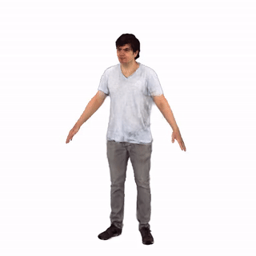
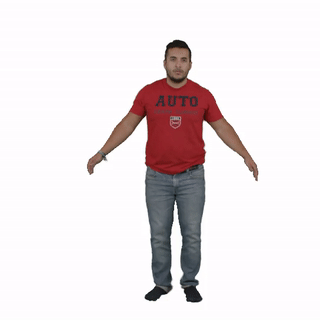
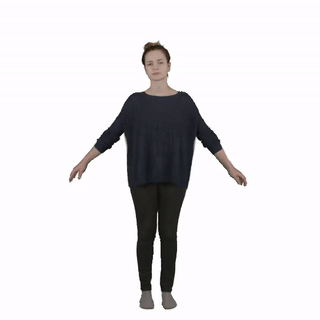
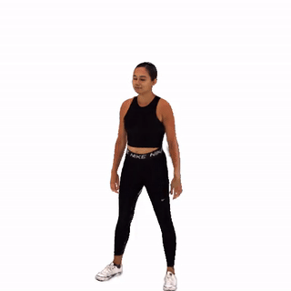

# HAHA: Highly Articulated Gaussian Human Avatars with Textured Mesh Prior

<p float="left">




</p>

Project page: https://david-svitov.github.io/HAHA_project_page/ </br>
Arxiv paper: https://arxiv.org/pdf/2404.01053.pdf </br>
YouTube video: https://youtu.be/vBzdAOKi1w0 </br>

We present HAHA - a novel approach for animatable human avatar generation from monocular input videos. The proposed method relies on learning the trade-off between the use of Gaussian splatting and a textured mesh for efficient and high fidelity rendering. We demonstrate its efficiency to animate and render full-body human avatars controlled via the SMPL-X parametric model. Our model learns to apply Gaussian splatting only in areas of the SMPL-X mesh where it is  necessary, like hair and out-of-mesh clothing. This results in a minimal number of Gaussians being used to represent the full avatar, and reduced rendering artifacts. This allows us to handle the animation of small body parts such as fingers that are traditionally disregarded. We demonstrate the effectiveness of our approach on two open datasets: SnapshotPeople and X-Humans. Our method demonstrates on par reconstruction quality to the state-of-the-art on SnapshotPeople, while using less than a third of Gaussians. HAHA outperforms previous state-of-the-art on novel poses from X-Humans both quantitatively and qualitatively.

## Installation

### Clone the repository

```commandline
git clone --recursive https://github.com/david-svitov/HAHA.git
```

### Environment

The easiest way to build an environment for this repository is to use docker image. To build it, make the following steps:
1. Build the image with the following command:
```
bash docker/build.sh
```
2. Start a container:
```
bash docker/run.sh
```
It mounts root directory of the host system to `/mounted/` inside docker and sets cloned repository path as a starting directory.

3. **Inside the container** install `diff_gaussian_rasterization-alphadep`. (Unfortunately, docker fails to install it during image building)
```
bash gaussian_install.sh
```

### Download dependencies


<details>
<summary>SMPL-X</summary>

Download SMPL-X v1.1 `models_smplx_v1_1.zip` from [SMPL-X official website](https://smpl-x.is.tue.mpg.de/download.php) and extract files to get:

```
models/smplx
    ├── SMPLX_FEMALE.pkl
    ├── SMPLX_FEMALE.npz
    ├── SMPLX_MALE.pkl
    ├── SMPLX_MALE.npz
    ├── SMPLX_NEUTRAL.pkl
    ├── SMPLX_NEUTRAL.npz
```

You will need to change the path to the models' folder in the config parameter ```smplx_path``` of the config in ```./configs/*.yaml``` you are going to use.


</details>
<details>
<summary>AMASS for novel poses rendering</summary>

Download the `SMPL-X N` package of `CMU` subset from [AMASS](https://amass.is.tue.mpg.de/index.html) and unzip it.

You will need to change the AMASS dataset pathin the config parameter ```animation_sequence``` of the config in ```./configs/*.yaml``` you are going to use.

</details>

## Evaluation

### Download pretrained models:

#### PeopleSnapshot

```white``` - Results rendered with white background</br>
```black``` - Results rendered with black background

|                                                Male-3-casual                                                |                                                                                    Female-3-casual                                                                                    |                                                Male-4-casual                                                |                                               Female-4-casual                                               |
|:-----------------------------------------------------------------------------------------------------------:|:-------------------------------------------------------------------------------------------------------------------------------------------------------------------------------------:|:-----------------------------------------------------------------------------------------------------------:|:-----------------------------------------------------------------------------------------------------------:|
|      [Checkpoint](https://drive.google.com/file/d/1ebymbUv3KonBNobMalaWOnhX4f5TpHGS/view?usp=sharing)       |                                           [Checkpoint](https://drive.google.com/file/d/1gg7L3PnjL1Q_R8qJEVZ48hUNrj-jZrNo/view?usp=sharing)                                            |      [Checkpoint](https://drive.google.com/file/d/1-3vwUnpplev2M79maZR27-cbhAuClwFZ/view?usp=sharing)       |      [Checkpoint](https://drive.google.com/file/d/1gEqHxBKyDWflIL5DSI6dzsP98670bFpd/view?usp=sharing)       |
|    [Renders (white)](https://drive.google.com/file/d/1swy427EGTo-SFYFpt4iAmaqSXpEOPmHg/view?usp=sharing)    |                                         [Renders (white)](https://drive.google.com/file/d/1_wuoLwj_CBxi-EjIkUO_3znFI_Uu_IkT/view?usp=sharing)                                         |    [Renders (white)](https://drive.google.com/file/d/1a2MllGJcp5MDYTKwZKD_Y0grnFGaYBmf/view?usp=sharing)    |    [Renders (white)](https://drive.google.com/file/d/1a9UzchEdE1tjJcBDTf4Mu4WsSjzTH2Ol/view?usp=sharing)    |
|    [Renders (black)](https://drive.google.com/file/d/1gzAwQAxGu3A9yqb4ArqUHbXueAxj1o1A/view?usp=sharing)    |                                         [Renders (black)](https://drive.google.com/file/d/1UdOgVV5RRhOe1YDmnBzIS621Mtbt93cD/view?usp=sharing)                                         |    [Renders (black)](https://drive.google.com/file/d/1AMyBh9WsqwNGwnfHV2G5uy-L-Ve7HgVq/view?usp=sharing)    |    [Renders (black)](https://drive.google.com/file/d/1XM8n2lRbXrxVrQbt3e1GeETM7bIOc-ey/view?usp=sharing)    |
| [Renders (Novel poses)](https://drive.google.com/file/d/1qNH0C0oCIST1kI3-tCW8tRJg6tiYx7WT/view?usp=sharing) |                                      [Renders (Novel poses)](https://drive.google.com/file/d/13Hm0LgT61q441nJeHGqX8W356przQcCv/view?usp=sharing)                                      | [Renders (Novel poses)](https://drive.google.com/file/d/1tsjL1aQnslwNIx7LJeVD0IbaG4A0CGL0/view?usp=sharing) | [Renders (Novel poses)](https://drive.google.com/file/d/1mRFWMr7aAVGn1Y8bZs_d3m6aRqtlecgP/view?usp=sharing) |

Or [Download all](https://drive.google.com/drive/folders/1NcW3PwAmytr7C5PtNWHae55-oV8F2qUD?usp=sharing0) checkpoints and renders.

#### X-Humans

For X-Humans all renders are provided in novel poses.

|                                                                                         00016                                                                                          |                                                 00019                                                 |                                                 00018                                                 |                                                 00027                                                 |
|:--------------------------------------------------------------------------------------------------------------------------------------------------------------------------------------:|:-----------------------------------------------------------------------------------------------------:|:-----------------------------------------------------------------------------------------------------:|:-----------------------------------------------------------------------------------------------------:|
|                                            [Checkpoint](https://drive.google.com/file/d/12hdMOcLR1Mklj4QyDOlqE7XEDK73c0af/view?usp=sharing)                                            |   [Checkpoint](https://drive.google.com/file/d/1T5pSsyqmqFbhGBBDd64SZBDhK5X89QP6/view?usp=sharing)    |   [Checkpoint](https://drive.google.com/file/d/1ybuGxXu7kWr8xPhAceUcyCiAwOOfUWJN/view?usp=sharing)    |   [Checkpoint](https://drive.google.com/file/d/1low_1_UTE5iIMlQEn-NjOaETNHOzdrSd/view?usp=sharing)    |
|                                         [Renders (white)](https://drive.google.com/file/d/1vn1gDGd8almkdsZdSAMi-VjLGyIXwlG3/view?usp=sharing)                                          | [Renders (white)](https://drive.google.com/file/d/1UKvR1Wft_botUCU1a2_gYXHwhTkxU1HG/view?usp=sharing) | [Renders (white)](https://drive.google.com/file/d/1bT7KYBl663E1-cSEeuJPeuxdYLCKN9vP/view?usp=sharing) | [Renders (white)](https://drive.google.com/file/d/1gRUUgU4_hsPsJ-Yjp6WzUVjvEIC5_t1N/view?usp=sharing) |
|                                                              [Renders (black)](https://drive.google.com/file/d/1u1KfF9UovkAFOpUCPTLF4EuAGHz92A-i/view?usp=sharing)                     |                                          [Renders (black)](https://drive.google.com/file/d/1Hix9lmLmCjgY74xaIElN-YZMGgZsDoED/view?usp=sharing)                                          |                                          [Renders (black)](https://drive.google.com/file/d/1_6MdKTUVKZQApqgZVBEXZojtAS-oPdA7/view?usp=sharing)                                          |                                          [Renders (black)](https://drive.google.com/file/d/1kjKIXuEN9DSco1-xMs90XaR7YBLaeUee/view?usp=sharing)                                          |

Or [Download all](https://drive.google.com/drive/folders/1lsgk1Mtq_WWi9sFn-Mc7UHs2Lv3C-_cV?usp=sharing) checkpoints and renders.

<details>
<summary>Table with names of the sequences used in the experiments</summary>

|                                 |    00016     |    00019     |    00018     |    00027     |
|:-------------------------------:|:------------:|:------------:|:------------:|:------------:|
|       Train sequence path       | /train/Take4 | /train/Take5 | /train/Take6 | /train/Take7 |
|       Test sequence path        | /train/Take6 | /train/Take7 | /train/Take9 | /train/Take6 |

</details>

### Render 
To generate an animation with an avatar, use the following command:

```
python main.py --base=./configs/<config name>.yaml --pretrained=/<checkpoints>/OPTIMIZE_OPACITY_10500.ckpt --test_mode
```


## Training

### Datasets preprocessing

<details>
<summary>SnapshotPeople</summary>

We use the data from [InstantAvatar](https://github.com/tijiang13/InstantAvatar) and finetuned their pre-processed poses to get SMPL-X fits.

Preprocessed data with SMPL-X fits can be downloaded [here](https://drive.google.com/file/d/1peE2RNuYoeouA8YS0XwyR2YEbLT5gseW/view?usp=sharing).

</details>

<details>
<summary>X-Humans</summary>

The data can be requested and downloaded [here](https://github.com/Skype-line/X-Avatar?tab=readme-ov-file).

No special preprocessing is required.


</details>

### Training

To train an avatar, run the code as follows. Make sure to modify all necessary paths in the config file.

```
python main.py --base=./configs/<config name>.yaml
```

## Citation

If you find this code useful for your research, please consider citing:
```bibtex
@article{svitov2024haha,
  title={Haha: Highly articulated gaussian human avatars with textured mesh prior},
  author={Svitov, David and Morerio, Pietro and Agapito, Lourdes and Del Bue, Alessio},
  journal={ACCV},
  year={2024}
}
